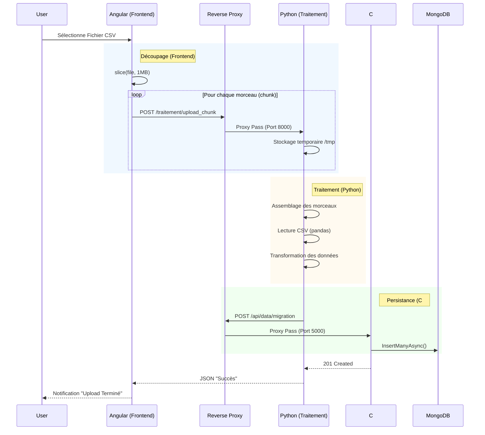

# Architecture & Flux de Données

Ce document décrit le cheminement complet d'un fichier CSV depuis l'upload utilisateur jusqu'à l'insertion en base de données, démontrant le rôle central du service de traitement Python.

## Schéma du Flux (Data Flow)



## Vérification par le Code

Voici les preuves que le fichier passe bien par le service de traitement (Python).

### 1. Frontend (Angular)

Il n'appelle **jamais** l'API C# directement pour l'upload. Il cible `/traitement/upload_chunk`.

> [!NOTE]
> Fichier : [add-data.component.ts](file:///Users/pauls/Documents/IUT/R5.Real.07 - Automatisation de la chaîne de programmation/Projet/projet-automatisation-chaine-prod/IHM/src/app/add-data/add-data.component.ts)

```typescript
this.http.post("/traitement/upload_chunk", formData);
```

### 2. Reverse Proxy (Nginx)

La route `/traitement/` redirige vers le conteneur Python (`traitement-fastapi`) sur le port 8000.

> [!NOTE]
> Fichier : [nginx.conf](file:///Users/pauls/Documents/IUT/R5.Real.07 - Automatisation de la chaîne de programmation/Projet/projet-automatisation-chaine-prod/nginx/nginx.conf)

```nginx
location /traitement/ {
    proxy_pass http://traitement/;
}
```

### 3. Service de Traitement (Python)

C'est ici que la logique se fait. Le script :

1.  Reçoit les morceaux (`upload_chunk`).
2.  Reconstitue le fichier.
3.  Utilise **pandas** pour lire et nettoyer le CSV.
4.  Envoie les données propres à l'API C#.

> [!NOTE]
> Fichier : [main.py](file:///Users/pauls/Documents/IUT/R5.Real.07 - Automatisation de la chaîne de programmation/Projet/projet-automatisation-chaine-prod/TRAITEMENT/main.py)

```python
# Lecture et Parsing
df = pd.read_csv(final_file_path)

# Envoi à l'API C#
api_endpoint = f"{API_URL}/api/migration"
requests.post(api_endpoint, json=reports)
```

### 4. API Backend (C#)

L'API reçoit des données JSON déjà structurées (et non un fichier brut).

> [!NOTE]
> Fichier : [MigrationController.cs](file:///Users/pauls/Documents/IUT/R5.Real.07 - Automatisation de la chaîne de programmation/Projet/projet-automatisation-chaine-prod/API/Controllers/MigrationController.cs)

```csharp
[HttpPost]
public async Task<IActionResult> Post([FromBody] List<MigrationReport> reports)
```
